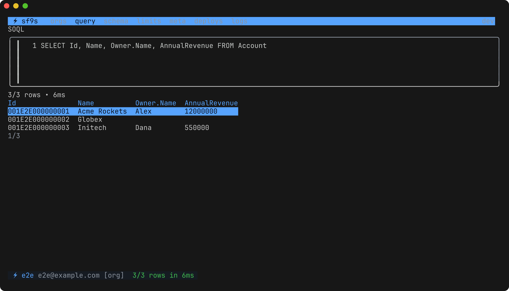
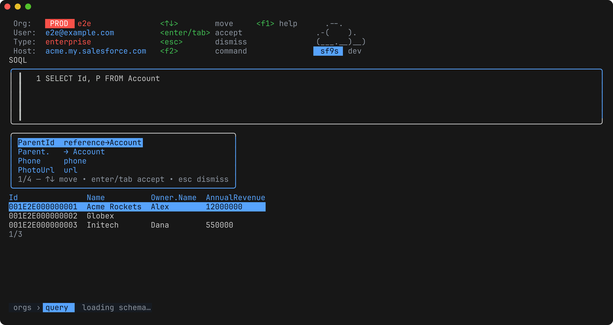

<div align="center">

# ⚡ sf9s

**k9s for Salesforce.** A fast, keyboard-driven terminal cockpit for every org
you're logged into — query, schema, limits, metadata, deployments and debug
logs, without leaving your terminal or configuring anything.

[](https://github.com/razkevich/sf9s/actions/workflows/ci.yml)




</div>

## Why

The `sf` CLI is powerful but one-shot: every question about an org is another
command and another wall of JSON. The daily loop — *which orgs am I in? what's
in this object? run that query again, grab a token for curl, what just got
deployed, why did that Apex blow up* — deserves the k9s treatment: one binary,
zero config, single keystrokes.

sf9s reuses the auth you already have in the Salesforce CLI, the same way k9s
reuses your kubeconfig. If `sf org list` works, `sf9s` works.

## Install

```bash
# Homebrew (coming soon) / releases
# grab a binary from https://github.com/razkevich/sf9s/releases

# or with Go
go install github.com/razkevich/sf9s/cmd/sf9s@latest
```

Requires the [Salesforce CLI](https://developer.salesforce.com/tools/salesforcecli)
on your PATH with at least one authenticated org (`sf org login web`).

## Autocomplete

Press `tab` (or `ctrl+space`) and sf9s completes from your org's real schema:
objects after `FROM`, fields inside `SELECT` / `WHERE` / `ORDER BY`, and
relationship paths — `Owner.` then `tab` again lists the target object's
fields. Unambiguous prefixes insert directly; ambiguous ones show a picker
with each candidate's type. Suggestions come from the describe cache, so they
are instant once an object has been touched, and a request made while the
schema is still downloading is answered when it arrives.



## Views

| view | what you get |
|---|---|
| **orgs** | every authenticated org: type, status, scratch expiry, defaults. `o` opens it in the browser (logged in via frontdoor), `y` copies an access token, `Y` the instance URL |
| **query** | multi-line SOQL editor with **autocomplete** (`tab`), history (`ctrl+p/n`), saved-query library (`ctrl+s`), Tooling API toggle (`ctrl+t`), pagination (`m`), row inspector (`enter`), copy cell/row (`y`/`Y`), CSV/JSON export (`e`/`E`) |
| **schema** | fuzzy-searchable objects → fields with types, reference targets, picklist values; `c` builds a SELECT for the query view, `y` copies API names |
| **limits** | org limits sorted by usage, with thresholds that go amber at 75% and red at 90% |
| **meta** | metadata inventory: 200+ types → components with *last modified by/at* — "who touched this layout?" in three keystrokes |
| **deploys** | recent metadata deployments with component/test counts and error details |
| **logs** | Apex debug logs: browse, open, search inside a log (`/`, `n/N`), delete |

Navigate anywhere with the `:` command palette (like k9s), `?` shows every
key, `/` filters any table, `esc` always goes back, `ctrl+c` always quits.

## Keys (the short version)

```
:            command palette          /       filter any table
?            help                     esc     back / close
enter        select / inspect         q       back (quit on orgs view)
h j k l      move rows / pan columns  g G     top / bottom
tab          complete at cursor       ctrl+r  run query
```

Run `sf9s -o my-alias` to land directly on a specific org.

## Saved queries

First run creates `~/.config/sf9s/queries.yaml` (platform-appropriate
location) with useful starters. Add your own:

```yaml
queries:
  - name: Hot accounts
    query: SELECT Id, Name, Owner.Name FROM Account WHERE LastActivityDate = LAST_N_DAYS:7
  - name: Flow versions
    query: SELECT DefinitionId, VersionNumber, Status FROM Flow ORDER BY LastModifiedDate DESC
    tooling: true
```

They're org-agnostic and appear in the `ctrl+s` picker, run on `enter`.

## Design notes

- **Zero config, zero credentials stored.** Tokens are resolved through
  `sf org display` on demand, cached in memory only, and never written to disk.
  The only file sf9s ever writes into an org is nothing; the only org write at
  all is deleting an Apex log, behind a confirm.
- **Fast where it counts.** Interactive reads (query/describe/limits) go
  straight to the REST API with a cached token — ~100–300 ms round trips —
  while org inventory and metadata listing delegate to the CLI that already
  owns that logic. Describes are disk-cached for instant schema browsing.
- **Honest tables.** Query columns come back in *your* SELECT order (raw JSON
  order-preserving parse), numbers aren't mangled through float64, child
  subqueries summarize as `(n rows)`, nulls render empty.

Architecture, requirements and testing strategy live in [docs/](docs/).

## Testing

Four layers. Unit tests per package; message-loop tests for every view; an
end-to-end suite that boots the **real TUI** (via
[teatest](https://github.com/charmbracelet/x)) against a fake `sf` binary and
an in-process mock org, asserting on rendered terminal frames; and an
integration tier that runs the same journeys against a live
[sf-localstack](https://github.com/razkevich/sf-localstack) — a real Salesforce
API emulator — so wrong assumptions about the API surface there instead of in
front of a user.

```bash
go test ./...                                  # everything hermetic, no org needed
docker run -p 8080:8080 razkevich/sf-localstack
go test -tags localstack ./e2e/                # against the emulator
```

That last tier paid for itself immediately: it caught keystrokes being dropped
when you typed straight after selecting an org — a bug our own mock had been
masking.

## Roadmap

- Live Apex log tail; anonymous Apex execution
- Record editing / DML behind explicit safeguards
- Bulk API job monitor; SOSL search
- Homebrew tap, Bubble Tea v2 migration

## License

MIT © Alex Razkevich
