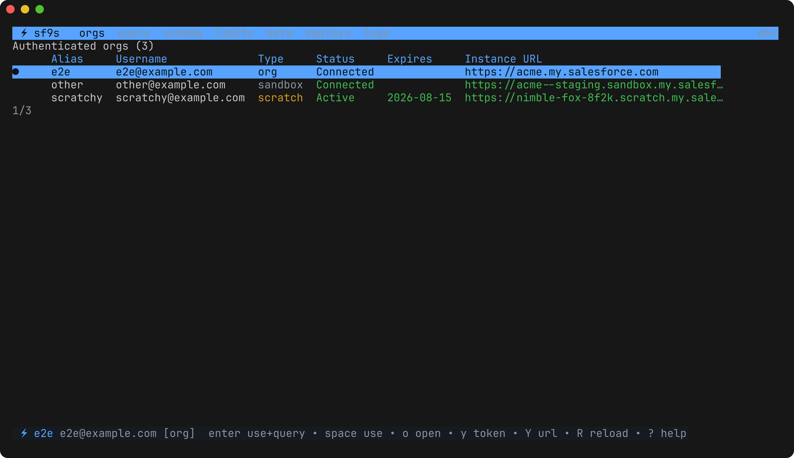
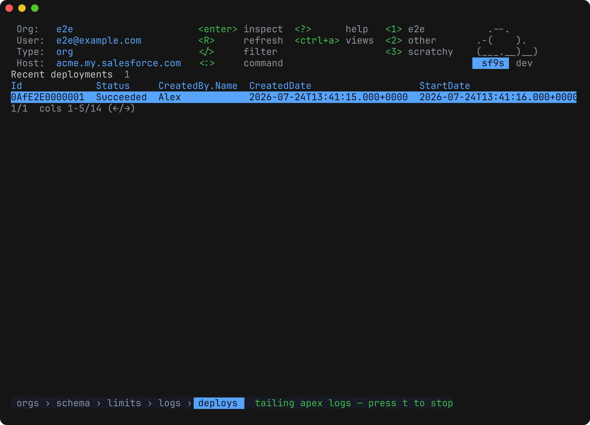

<div align="center">

# ⚡ sf9s

**A terminal UI for the Salesforce orgs you're already logged into.**
Run SOQL with autocomplete, browse schema, watch limits, inspect metadata and
deployments, and tail Apex logs — without leaving your terminal or configuring
anything.

[](https://github.com/razkevich/sf9s/actions/workflows/ci.yml)
[](https://github.com/razkevich/sf9s/releases)

[](LICENSE)



</div>

## Why

The `sf` CLI is one-shot: every question is another command and another wall of
JSON. sf9s keeps a session open over the orgs `sf` already knows about, the way
k9s does over your kubeconfig. If `sf org list` works, `sf9s` works — there is
nothing to configure and no second set of credentials.

It is **read-only** apart from one confirmed action (deleting an Apex log), and
it never stores a credential of its own.

## Install

```bash
# Go 1.26+
go install github.com/razkevich/sf9s/cmd/sf9s@latest

# or download a binary for macOS / Linux / Windows (amd64, arm64)
# https://github.com/razkevich/sf9s/releases
```

**Requires** the [Salesforce CLI](https://developer.salesforce.com/tools/salesforcecli)
on your `PATH` with at least one authenticated org:

```bash
npm install -g @salesforce/cli
sf org login web --alias my-org
```

Then:

```bash
sf9s              # start on your default org
sf9s -o my-org    # start on a specific one
sf9s -h           # flags, key bindings, and where config lives
```

## It tells you when you're in production

The `sf` CLI cannot distinguish a production tenant from a Developer Edition —
both are simply "not a sandbox" — so every org looks alike in `sf org list`.
sf9s asks the org what it is and marks it: a red `PROD` badge, the true edition,
`PRODUCTION` in the list, and a warning when you switch in. Sandboxes, scratch
orgs, Developer Editions and local emulators are recognised from the instance
host immediately, before any API call.

Nothing you type can change which org you're pointed at: the number keys switch
org only on the org list, and they never renumber themselves.

## SOQL with autocomplete


Press `tab` and sf9s completes from your org's real schema: objects after
`FROM`, fields inside `SELECT` / `WHERE` / `ORDER BY`, and relationship paths —
`Owner.` then `tab` again lists the target object's fields. Unambiguous prefixes
insert directly; ambiguous ones open a picker showing each candidate's type.

Results keep the column order you typed, numbers aren't mangled through
float64, child subqueries summarise as `(n rows)`, and nulls render empty.
`e` / `E` export the whole result set to CSV or JSON.

## Views

| | |
|---|---|
| **orgs** | Every authenticated org with its edition, status and scratch expiry. `d` explains a failing connection in plain English — "the user is deactivated, ask an admin to reactivate; logging in again won't help" — instead of truncating the error. |
| **query** | SOQL editor with autocomplete, history, a saved-query library, Tooling API toggle, pagination, row inspector, and CSV/JSON export. |
| **schema** | Fuzzy-searchable objects → fields with types, reference targets and whether they're required. `enter` opens a field card with the **complete** picklist; `c` builds a `SELECT` into the query view. |
| **limits** | Org limits sorted by consumption, amber past 75%, red past 90%. |
| **meta** | Metadata inventory: 200+ types → components with who changed them and when. Answers "who touched this layout?" in three keystrokes. |
| **deploys** | Recent deployments. `enter` lists the failing components and Apex tests with line numbers; `enter` again shows one in full with its stack trace. |
| **logs** | Apex debug logs: browse, open, search inside a log, and `t` to tail new ones as they arrive. |



## Getting around

Navigation follows k9s. The header always shows what the current view can do.

```
:              command mode          :query :schema :limits :meta :deploys :logs
               with aliases          :sql   :sc     :lim    :md   :dep     :apex
:org <alias>   switch to any org     :q     quit
ctrl+a         list every view
1 … 9          switch org            (org list only — numbers are stable)
/              filter any table      s      sort by the column in view
esc            back one level        ?      keys for this view (f1 while typing)
ctrl+c         quit
```

`esc` unwinds one thing at a time — a filter, then an open card or drill-down,
then the view — and a breadcrumb at the bottom shows where you are.

Inside the query editor `:` and `?` are query characters, so **`f1`** and
**`f2`** reach help and command mode from there.

## Saved queries

The first time you open the picker (`ctrl+s`) sf9s writes a starter library you
can edit. `sf9s -h` prints the exact path; it's `~/.config/sf9s/queries.yaml` on
Linux and `~/Library/Application Support/sf9s/queries.yaml` on macOS.

```yaml
queries:
  - name: Hot accounts
    query: SELECT Id, Name, Owner.Name FROM Account WHERE LastActivityDate = LAST_N_DAYS:7
  - name: Flow versions
    query: SELECT DefinitionId, VersionNumber, Status FROM Flow ORDER BY LastModifiedDate DESC
    tooling: true
```

They're org-agnostic, so the same library works everywhere. This is also where
team- or project-specific queries belong — no need to touch the tool.

## Configuration

sf9s needs no config file. Three environment variables adjust it:

| Variable | Effect |
|---|---|
| `SF9S_EXPORT_DIR` | Where `e` / `E` write exports (default `~/Downloads`) |
| `SF9S_ALLOW_HTTP=1` | Permit plaintext instance URLs — only for local org emulators |
| `NO_COLOR=1` | Disable styling (also honoured for `TERM=dumb`) |

Caches (describes, org inventory) live under your OS cache directory and are
safe to delete at any time.

## How it handles credentials

- Tokens are resolved through the `sf` CLI on demand and held in memory only —
  never written to disk, never logged.
- Salesforce CLI 2.136.8 removed credentials from `sf org display`; sf9s falls
  back to `sf org auth show-access-token`, so it works on CLIs either side of
  that change.
- `o` opens an org in the browser via `sf org open`, so no session token passes
  through sf9s's process arguments or a URL it builds.
- `y` copies an access token deliberately: it warns what the token grants and
  clears the clipboard after 90 seconds, unless you've copied something else
  since.
- Credentialed requests require HTTPS (or loopback), refuse redirects, and
  require TLS 1.2 or better.

## Compatibility

| | |
|---|---|
| Salesforce CLI | Any recent `sf` v2, including 2.136.8+ where tokens moved |
| API version | Whatever your org reports; falls back to v64.0 |
| Platforms | macOS, Linux, Windows — amd64 and arm64 |
| Terminals | 256-colour and truecolor; degrades on `NO_COLOR` and `TERM=dumb`; usable from 80×24 up |

## Troubleshooting

**"Salesforce CLI not found"** — install it (`npm install -g @salesforce/cli`)
and make sure `sf` is on the `PATH` sf9s inherits.

**"No authenticated orgs"** — `sf org login web --alias my-org`.

**An org shows a connection error** — press `d` on it. sf9s explains what the
error means and what to do about it, and shows the org's full status text.

**Startup takes a few seconds** — `sf org list` contacts every org to check its
status. sf9s renders the list before that finishes and fills statuses in as
they arrive; later launches paint immediately from cache.

## Development

```bash
make build              # build ./sf9s
make install            # install to $GOPATH/bin, version-stamped
go test ./...           # unit, view and end-to-end tests — no org required
golangci-lint run
```

Tests run in four layers: per-package unit tests, message-loop tests for every
view, an end-to-end suite that drives the **real TUI** against a fake `sf`
binary and an in-process mock org, and an optional tier against a live
[sf-localstack](https://github.com/razkevich/sf-localstack):

```bash
docker run -p 8080:8080 razkevich/sf-localstack
go test -tags localstack ./e2e/
```

Design notes, requirements and the reasoning behind the main decisions are in
[docs/](docs/).

## Roadmap

- `FIELDS(ALL)` in the record inspector
- Creating trace flags, so the log tail has something to tail
- Cross-org schema and record diff
- SOSL search; Bulk API job monitor
- Homebrew tap and `sf plugins` distribution

Issues and pull requests welcome.

## License

MIT © Alex Razkevich
